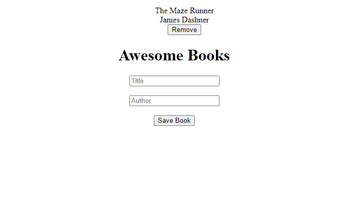

---

# Project Name
Awsome Books library
---

> One paragraph statement about the project.

---

Additional description about the project and its features.

## Built With
---

- Html
- Css
- Javascript

## Live Demo
---

[Live Demo Link](https://munsa1.github.io/Awesome-Books/)

## Getting Started
---

**This is an example of how you may give instructions on setting up your project locally.**
**Modify this file to match your project, remove sections that don't apply. For example: delete the testing section if the currect project doesn't require testing.**

To get a local copy up and running follow these simple example steps.

### Prerequisites
---

- Web browser

- Html text editor

## Authors:
---

👤 **Author1**

👤 **Munsa Mibenge**

GitHub: [@Munsa1](https://github.com/munsa1)
- Twitter: [@twitterhandle](https://twitter.com/twitterhandle)
- LinkedIn: [LinkedIn](https://linkedin.com/in/linkedinhandle)

👤 **Author2**

 Github:[@SheylaPozo](https://github.com/sheylaPozo)
- Linkedin: [Sheyla Pozo](https://www.linkedin.com/in/sheypozo/)
- Twitter: [Sheyla Pozo](https://twitter.com/sheyPozo)

## 🤝 Contributing

Contributions, issues, and feature requests are welcome!

Feel free to check the [issues page](https://github.com/Munsa1/Awesome-Books/issues)

## Show your support

Give a ⭐️ if you like this project!

## Acknowledgments

- Hat tip to anyone whose code was used
- Inspiration
- etc

## 📝 License

This project is [MIT](./MIT.md) licensed.
